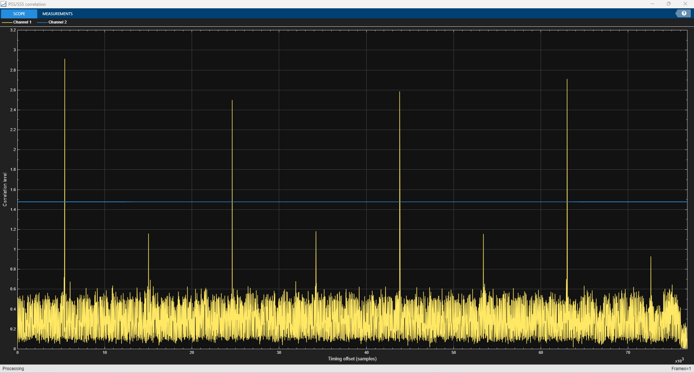

# 4G-LTE-Cell-Search-MIB-and-SIB1-recovery

Capture a live Over The Air (OTA) 4G/LTE signal using Adalm-Pluto SDR and demodulate LTE frames with MATLAB code to obtain MIB and SIB1 messages.

*PSS/SSS correlation at 1.92 Msps for the Band 28 capture. The tall peaks, 19,200 samples (10 ms) apart, are subframe 0; the smaller peaks between them are subframe 5. The blue line is the weak-correlation threshold.*

## Capture

`B28LTEcapture.bb` is a single over-the-air recording written by MATLAB `comm.BasebandFileWriter`. All values come from the file header.

| Parameter | Value |
| --- | --- |
| Date | 25 Aug 2022, 12:16:25 |
| Radio | ADALM-Pluto (AD9361), `usb:0`, `ip:10.0.0.200` |
| Centre frequency | 773 MHz (LTE Band 28 downlink, 758-803 MHz) |
| Sample rate | 30.72 Msps, complex double, single channel |
| Duration | 40 ms, 1,228,800 samples |
| Gain | AGC, slow attack |
| RF bandwidth | 18 MHz, custom filter off |

Antenna, location and cabling were not recorded. Spectrum levels are uncalibrated (AGC on).

## Result

| Item | Value |
| --- | --- |
| Cell | PCI 63, FDD, normal cyclic prefix, 2 antenna ports |
| Bandwidth | 50 PRB (10 MHz) |
| Carrier frequency offset | about +13.2 kHz (17.1 ppm at 773 MHz) |
| MIB | decoded at SFN 425 |
| SIB1 | CRC pass in SFN 426 (RV 2) and SFN 428 (RV 3) |
| SIB1 contents | PLMN 621-30, TAC 0x5828, cell identity 0x565AE0A, band 28 |

The Pluto's oscillator error exceeds the +/-7.5 kHz range of the cyclic-prefix frequency estimator, so `SIB1RecoveryExample_wCoarseFr.m` adds a coarse search over +/-300 kHz in 5 kHz steps before cell search.

## Contents

| Path | Description |
| --- | --- |
| `SIB1RecoveryExample_wCoarseFr.m` | MATLAB LTE Toolbox receiver: cell search, MIB, SIB1 |
| `PSSpeak.m`, `hPDSCHConfiguration.m`, `hPlotPositions.m`, `hSIB1RecoveryExamplePlots.m` | Helper functions |
| `B28LTEcapture.bb` | The Band 28 capture |
| `eNodeBOutput.mat` | 15.36 Msps example capture from the original MathWorks example |
| `validation/` | Independent decode of the same capture; see [validation/README.md](validation/README.md) |
| `validation/matlab_rerun/` | Console log and figures from the October 2026 rerun of the MATLAB receiver |

## Requirements

MATLAB with LTE Toolbox, Communications Toolbox and DSP System Toolbox. Run `SIB1RecoveryExample_wCoarseFr` from the repository root.

## Validation

The same capture was decoded with a separate toolchain (Python synchronisation, srsRAN 4G `pdsch_ue`, ASN.1 decode of SIB1). It agrees with the MATLAB receiver on PCI, bandwidth, port count, SFN and the SIB1 bytes (`405884615828565ae0a821b0908104596000`). See [validation/README.md](validation/README.md).